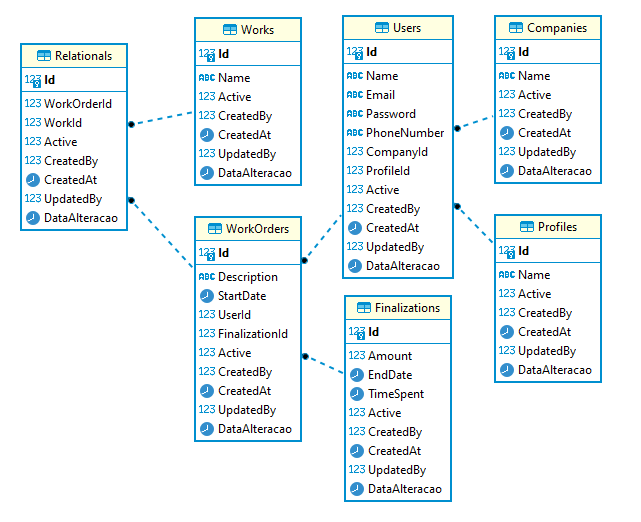

# Work Order Application

This is a .NET 8 based Work Order application using SQL Server, with Docker Compose for containerization. The application allows managing companies, users, profiles, works, work orders, and finalizations.

## Table of Contents
- [User Stories](#user-stories)
- [Project Structure](#project-structure)
- [Database Diagram](#database-diagram)
- [Running the Application](#running-the-application)
- [API Testing](#api-testing)

## User Stories

### Managing Companies
- **As** an administrator,
- **I want** to be able to create, view, update, and delete company information,
- **So that** I can maintain the records of all the companies we work with.

### Managing Users
- **As** an administrator,
- **I want** to create new users, update their information, deactivate or remove them,
- **So that** I can manage access and ensure that only authorized users use the system.

### Managing User Profiles
- **As** an administrator,
- **I want** to define different user profiles,
- **So that** I can assign specific permissions and roles to different types of users.

### Managing Works
- **As** a user,
- **I want** to create, view, update, and delete works,
- **So that** I can manage ongoing and future projects.

### Managing Work Orders
- **As** a user,
- **I want** to create, view, update, and delete work orders,
- **So that** I can organize and manage the tasks associated with each work.

### Finalizing Work Orders
- **As** a user,
- **I want** to finalize work orders by recording the time spent and costs,
- **So that** I can accurately track the progress and completion of tasks.

### Associating Works and Work Orders
- **As** a user,
- **I want** to associate works with work orders,
- **So that** I can link and monitor the progress of specific tasks within a larger project.

## Project Structure


## Database Diagram



## Running the Application

To run the application using Docker Compose:

```sh
docker-compose up -d
```

This will start the application and the SQL Server database.

## API Testing

You can test the APIs using the Swagger UI available at `http://localhost:8080/swagger`. The application provides a Swagger UI for API documentation and testing. 